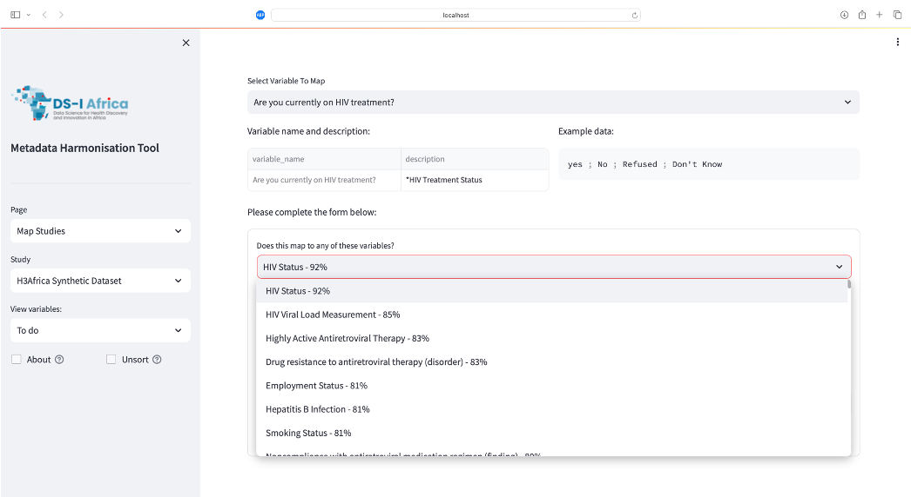

[![CC BY-SA 4.0][cc-by-sa-shield]][cc-by-sa]

# Health Data Harmonisation Platform

This repository contains two primary elements:
1) A general template being used by the [HE2AT Centre](https://heatcenter.wrhi.ac.za) data harmonisation team, here using the [CINECA synthetic cohort Africa H3ABioNet v1](https://www.cineca-project.eu/synthetic-data/sdc-africa-h3abionet-v1) dataset as an example.
2) A simple [streamlit](https://streamlit.io) application we have constructed that facilitates the matching of variables in the incoming studies to our codebook.

## General work flow:

### Initialise:

This repository is intended to form the foundation of a jupyter lab based data science platform. To configure this on your local machine follow these instructions:

```
git clone git@github.com:csag-uct/Health_Data_Harmonisation_Platform.git
cd Health_Data_Harmonisation_Platform

conda create --name health_harmonisation
conda activate health_harmonisation
conda install --file requirements.txt

jupyter lab
```

### Step 1: 

This platform is built to harmonise incoming datasets to a single study codebook. An example codebook is included in this repository at `codebook/target_codebook.xlsx`. The semi-automated process of mapping incoming dataset variables to this codebook, outlined in this repo, utilises a [text-embedding](https://platform.openai.com/docs/guides/embeddings/what-are-embeddings) approach. The notebook located at `codebook/get_codebook_embeddings.ipynb` is used to standardize the codebook to a csv format and fetches embedding vectors from OpenAI - there is a nominal cost involved in this process. 


### Step 2: 

From here incoming study data is expected to be placed into the `data/{study}` folder. Where `{study}` is the codename used for respective studies going forward. Accompanying study documents are placed into the `data/study_docs` folder and study data is placed into the `data/raw` folder. The cookbook style notebooks located at `data/{study}/code/to_csv.ipynb` and  `data/{study}/code/get_vars.ipynb` are used to populate the `data/csv` and `data/metadata` folders respectively. 

### Step 3: 

The notebook located at `code/01_progress_monitor.ipynb` can be used to track the progress of steps 1-3. Once all studies have been converted to csv format and variable names and abbreviations extracted the notebook at `code/02_generate_synthetic_data.ipynb` can be used to generate a randomized dataset for each study. This is used for the mapping interface. Next the notebook at `code/03_ontology_recommendation_engine.ipynb` is used to to first fetch embedding vectors for the incoming study variables before ranking the codebook variables from most to least similar for each incoming study variable. 

### Step 4 / TL;DR:

Once the above has been completed the mapping GUI is ready to be used. (These have already been completed in this example repo). To run the GUI follow these instructions:

```
cd app/
streamlit run Home.py
```

This should automatically open your browser to this page:



### step 5:
Work in progress. 

The intention is that the GUI can be used to create data pipelines that extract and convert mapped variables from the standardised study files to a single harmonised dataset. 


This work is licensed under a
[Creative Commons Attribution-ShareAlike 4.0 International License][cc-by-sa].  [![CC BY-SA 4.0][cc-by-sa-image]][cc-by-sa]

[cc-by-sa]: http://creativecommons.org/licenses/by-sa/4.0/
[cc-by-sa-image]: https://licensebuttons.net/l/by-sa/4.0/88x31.png
[cc-by-sa-shield]: https://img.shields.io/badge/License-CC%20BY--SA%204.0-lightgrey.svg

